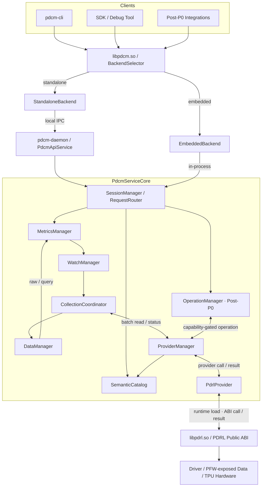
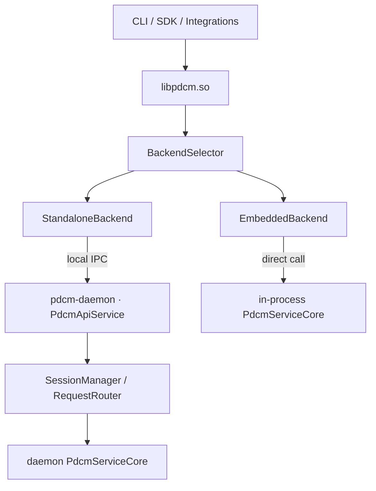
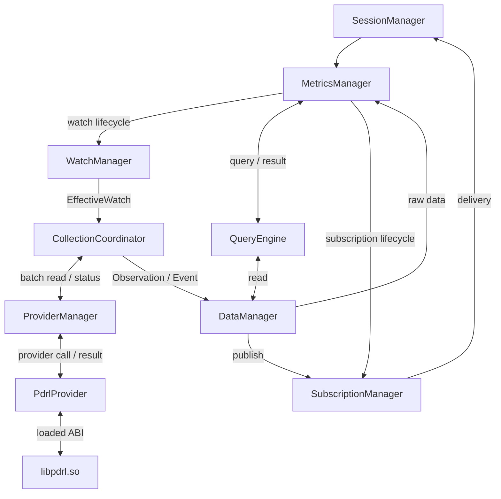
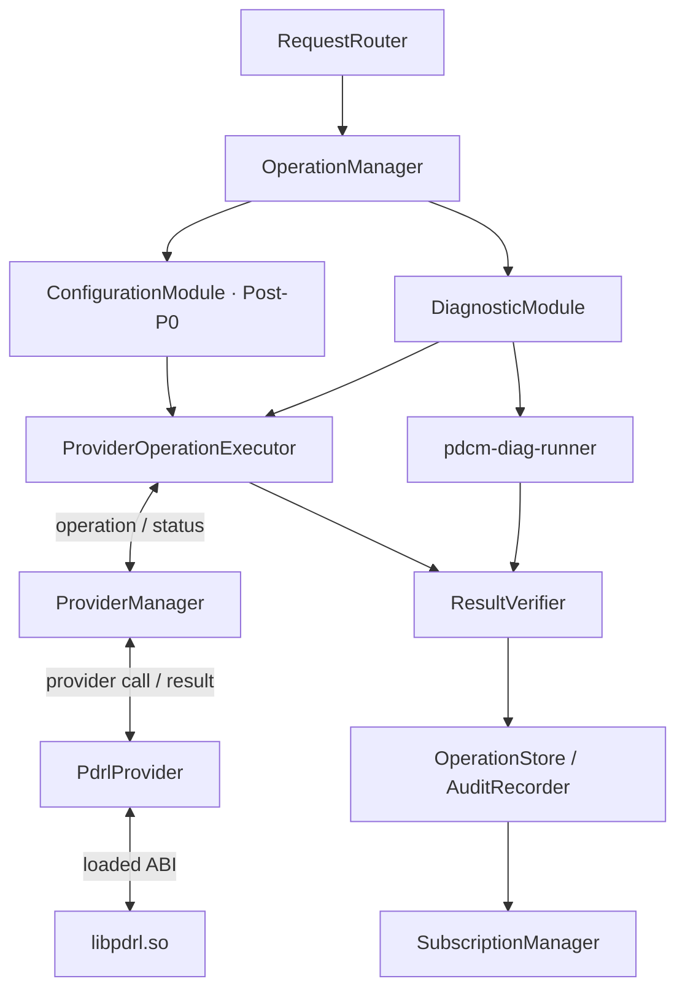
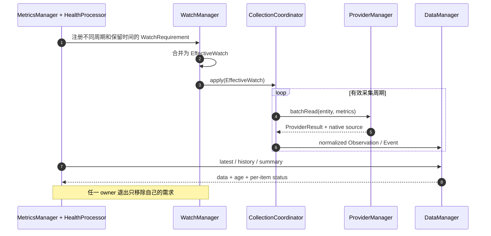
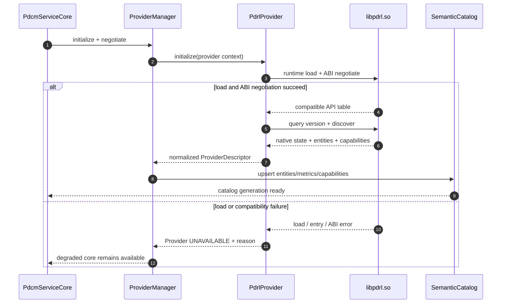
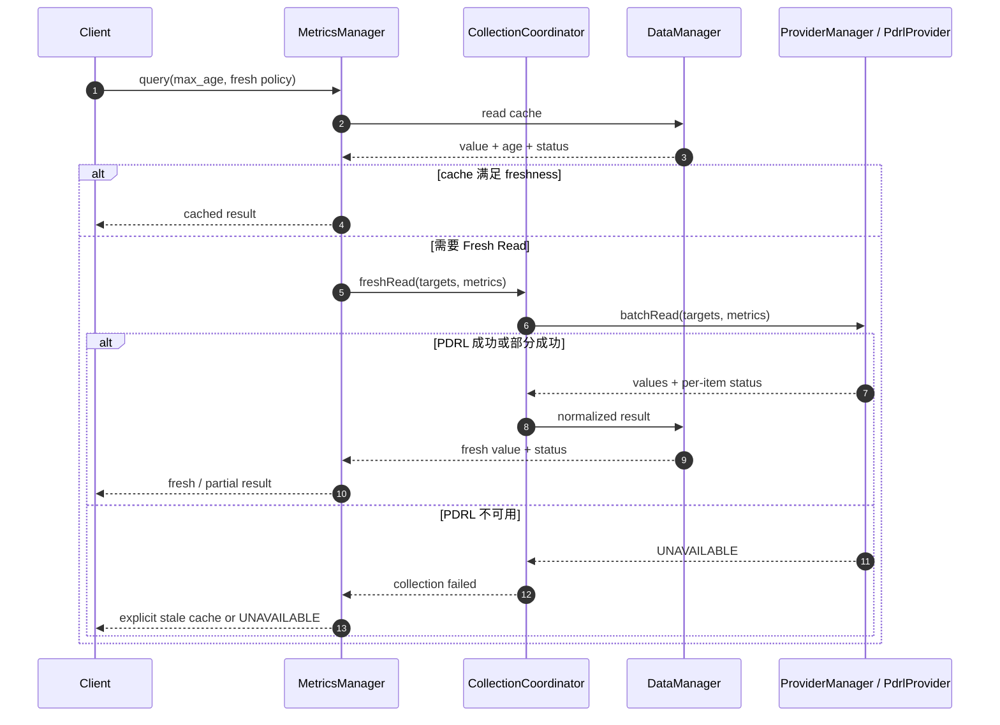

# RFC：PDCM 自研 TPU 设备管理与运行时洞察架构
## Architecture Draft v0.8.2 — Runtime Library Boundary and Scope Cleanup

> **Status**：Proposed
>
> **Audience**：PDCM、PRT、PDRL、PFW、Infra、调度与运维团队
>
> **Decision Scope**：P0 系统边界、软件产物、顶层组件、核心数据流、公共 API 和 PDCM–PDRL Provider Contract
>
> **TDD Scope**：类设计、线程模型、存储结构、调度算法、状态机细节、性能参数、PDRL 具体能力要求、函数映射与测试实现
>
> **Naming**：公共 API 使用 `pdcm_` / `PDCM_`；PRT、PDRL、PFW 保持各团队既有代号
>
> **P0 Baseline**：仅支持单卡节点；AC-1/2/3/4/7/8/9/11 纳入 P0，其中 AC-3 的具体 Metric 集合等待底层团队冻结；AC-5/6/10 当前不支持

---

# 1. Summary

PDCM 是面向公司自研 TPU 的节点级设备管理与运行时洞察基础设施。P0 面向 FPGA 与 EMU 的单卡节点，交付服务与 CLI 生命周期、单卡设备发现与静态清单、P0 Metrics 周期性采集、基于 Firmware heartbeat 的 Health、单卡故障健壮性与恢复语义。PDCM 向上为 CLI、SDK 和后续集成方提供统一接口，向下由 PDCM 内部 `PdrlProvider` 在运行时加载 PDRL 团队交付的 `libpdrl.so.<ABI-major>`，并通过其公共 ABI 获取 Driver 及正式暴露的 Firmware/硬件信息。

本 RFC 提议：

1. 每个 TPU 节点部署一个常驻 `pdcm-daemon`，统一持有节点管理状态；
2. 通过 `SemanticCatalog` 统一 Entity、Metric、Capability、Topology 和 Evidence 语义；
3. 使用 `WatchManager` 与 `CollectionCoordinator` 合并多客户端采集需求；
4. 使用 `DataManager` 管理短期遥测、事件、快照和 Health 证据；
5. 使用 `MetricsManager` 统一管理指标请求、派生指标和 Health 处理器；Policy 处理器保留为 Post-P0 扩展；
6. 保留 `OperationManager` 作为 Post-P0 扩展边界；P0 不交付 Basic Diagnostic、配置、复位或其他 Operation 能力；
7. 使用 PDCM 内部 `ProviderManager` 和 `PdrlProvider` 隔离 PDCM 语义与 PDRL API；`PdrlProvider` 运行时加载并校验 `libpdrl.so`，通过 Capability 表达加载后真实可用能力；
8. 仅发布一个 PDCM 公共动态库 `libpdcm.so`；standalone 与 embedded 的实现由内部静态库组合完成。

PDCM P0 主要吸收业界设备管理工具的常驻服务、共享 Watch、缓存和功能模块设计，并保留 Capability Discovery 与可扩展指标类型思路。Feature Specs 中的“DCGM”均按本项目 PDCM 理解；其中 P0 Field 统一解释为 P0 Metric，Field/FieldGroup 不进入 PDCM 数据模型。PDCM 使用 `MetricDescriptor`、`Observation` 和显式样本状态表达同等验收语义。Program/Run/HLO、Runtime Snapshot、Basic Diagnostic、Fault Injection、AC-10 性能验收及配置、Policy、Profile、Stats、完整 Topology、Exporter 等能力不属于当前 P0。

本 RFC 只冻结系统级决策和接口契约。组件内部实现全部进入后续 TDD。

---

# 2. Problem Statement

当前 PFW、PDRL、PRT 分别掌握不同层次的设备状态和控制能力。P0 需求主要是无需 workload Runtime 参与的静态或低频设备观测。如果每个监控、调试或运维工具分别调用 PDRL 接口，将产生以下问题：

- 相同状态被多个消费者重复采集，增加设备和 Host 开销；
- 同一指标在单位、采样时间、实体范围和错误语义上不一致；
- Firmware/硬件状态、Driver 生命周期和设备拓扑缺少统一关联；
- 芯片、Firmware 和 Driver 升级会直接冲击所有上层工具；
- PDRL 未初始化、Driver reload、单卡丢失或部分 Metric 失败时，上层缺少明确降级语义；
- 后续配置、reset 和主动诊断需要统一权限、状态、取消、验证和审计边界；
- PDRL 原生类型、错误码和生命周期会泄漏到所有上层工具。

PDCM 需要提供一个稳定的节点级控制点，使上层只依赖统一语义和公共契约。P0 通过一个 PDCM 自有的 `PdrlProvider` 集中加载 `libpdrl.so` 并调用 PDRL 公共 ABI；PDCM 其他组件不得直接依赖 PDRL 类型、符号或函数。gRPC `PRT Services` 方案作为后续需要 Runtime/workload 动态洞察时的演进选项，本 RFC 不将其作为 P0 运行依赖。

---

# 3. Context

## 3.1 自研 TPU 软件边界

| 领域 | 权威能力 | P0 对 PDCM 的交付路径 |
|---|---|---|
| PFW | Firmware heartbeat 及 Firmware/硬件原生状态 | P0 Health 仅使用 PDRL 公共 API 正式暴露的 Firmware heartbeat；其他信息按 Capability 处理 |
| PDRL | Device identity、单卡静态属性、基础遥测、Firmware heartbeat、Driver lifecycle | `PdrlProvider` 运行时加载 `libpdrl.so` 并调用 PDRL 公共 ABI |
| PRT | Runtime instance、Program、Run、Launch、HLO、Core/Queue/Snapshot | 不属于 P0 数据来源 |
| PDCM | 跨域统一表示、共享采集、查询和 Firmware heartbeat Health | 公共 API 与模块能力；Operation 为 Post-P0 预留 |

PDCM 与底层的直接契约是 `libpdrl.so` 暴露的 PDRL 公共 ABI。PDRL 定义原生数据和 Driver 生命周期语义；PFW 信息是否可见取决于 PDRL 的正式暴露能力；PRT Runtime 语义不在 P0 范围内。`PdrlProvider` 负责动态加载、ABI 协商以及将 PDRL 原生结果转换为 PDCM 内部 Provider Contract，`SemanticCatalog` 负责形成稳定的 PDCM 公共语义。

## 3.2 关键约束

- P0 不依赖 workload Runtime 初始化，Runtime/Program/Run/HLO 指标不作交付承诺；
- PDRL 团队以版本化共享库 `libpdrl.so.<ABI-major>` 交付公共 ABI；`PdrlProvider` 必须在运行时加载并完成 ABI 兼容校验，PDCM 不在链接时形成对该库的强制 `DT_NEEDED` 依赖；
- P0 只支持每节点 0 或 1 张可管理 TPU；多卡节点不属于支持矩阵，且不得静默选择其中一张卡；
- P0 主要处理静态属性、Gauge、低频 Counter 和 PDRL 已暴露的 Event；
- P0 Health 只有 `PDCM_HEALTH_SUBSYSTEM_FIRMWARE_HEARTBEAT`，证据必须经 `PdrlProvider → libpdrl.so Public ABI` 获取；
- AC-5 Basic Diagnostic、AC-6 Fault Injection 和 AC-10 性能与稳定性验收当前不支持，也不构成 P0 发布门槛；
- 不同芯片与软件组合支持的能力不同；
- reset 或 Driver reload 会改变 Entity generation；
- 部分控制操作持续时间长、具有副作用且可能部分成功；
- 节点需要低延迟本地能力，长期存储和跨节点分析由集群系统负责；
- PDRL API 的初始化、线程安全和 Driver reload 语义必须能够被 Provider 明确处理；
- PDRL、单卡或部分 Metric 不可用时，PDCM 必须返回逐项状态并允许显式读取旧 Cache。

## 3.3 RFC 与 TDD 的边界

本 RFC 冻结：

- 进程、公共动态库和内部静态库边界；
- `libpdrl.so` 作为 PDRL 交付形式、由 `PdrlProvider` 运行时加载，以及加载失败时的系统级降级语义；
- 顶层责任组件及依赖方向；
- 核心数据对象和错误语义；
- 公共 API、内部 Provider Contract 与 PDRL API 依赖边界；
- 三条核心运行通路。

以下内容由 TDD 冻结：

- 类、文件和源码目录划分；
- 锁、线程池、队列和回调线程；
- Watch 合并算法、批处理算法和成本预算；
- Cache、Journal、Repository 的具体数据结构；
- Operation 状态机的内部持久化；
- `libpdrl.so` 的可信查找规则、bootstrap symbol/API function table、PDRL 函数字段映射、锁策略、线程模型和具体重试参数；
- PDRL 对 Metric、heartbeat、Discovery、时间戳、错误码、生命周期和各硬件目标的具体支持要求；
- 每个 Metrics Processor（包括派生指标、Health 和 Policy）的规则和算法。

---

# 4. Goals

PDCM P0 MUST：

1. 支持 FPGA/EMU 上的干净安装与卸载、`pdcm-daemon` Start/Stop/Restart、CLI Version/Help，以及 CLI 与 daemon major version 不兼容时 Fail Fast；失败命令返回非零退出码，卸载后不残留运行进程；
2. 在单卡节点提供 Device 数量、PDCM Device ID、PDRL native ID、PCI BDF、设备状态和 PDRV version；UUID/Serial、设备内存容量、PFW/HW version 在 PDRL/平台提供时进入目标清单，否则显式标记 `UNSUPPORTED`；发现多于 1 张可管理 Device 时不得静默选卡，必须返回不支持配置并进入可诊断的降级状态；
3. 在底层团队冻结 P0 Metric Catalog 后，对单个 Device 周期采集其中全部 `REQUIRED` Metric，并支持调用方指定采样次数；每个 Required Metric 必须产生请求数量的样本或逐样本失败状态；Catalog 冻结前 AC-3 保持 `BLOCKED_EXTERNAL`；
4. 统一时间、类型、单位、freshness、generation 和来源语义；任一 Metric 为 `NOT_AVAILABLE` 或 `UNSUPPORTED` 时，其他 Metric 继续返回；
5. 仅对 `PDCM_HEALTH_SUBSYSTEM_FIRMWARE_HEARTBEAT` 返回 Health 结论：新鲜且有效的 heartbeat 为 `HEALTHY`，底层明确 warning/fault 时分别为 `WARNING`/`ERROR`，证据过期、timeout 或读取失败时为 `UNKNOWN`；不得从 Driver readiness、Device Access、PCIe、Memory、Sensor 或 RAS 推导额外 P0 Health；
6. 允许多个客户端共享单卡底层采集，避免重复访问设备；Device lost、单 Metric 失败、PDRL timeout 或非法返回不得导致 daemon crash/hang，且不得阻断仍可提供的生命周期、Discovery 状态、其他 Metric 与 Firmware heartbeat 查询；
7. 在 `libpdrl.so` 加载/ABI 协商失败、PDRL 初始化失败、Driver reload、设备 reset/replug、设备丢失或部分读取失败时提供明确降级；Service Restart 或外部设备生命周期事件后重新发现单卡并恢复 P0 采集，恢复前旧数据只能标记为 `STALE`；
8. 通过 Capability Discovery 适配硬件与软件代际差异，并仅向使用方发布一个 `libpdcm.so`，保证 standalone/embedded 公共 API 语义一致；
9. 交付并评审 Installation Guide、CLI Help、单卡支持矩阵、P0 Metric Catalog、Firmware Heartbeat Health 契约、Error Code、Troubleshooting、Compatibility Matrix、Known Issues 和 Release Notes；文档中的命令、默认值、Metric 和输出必须与发布包实测一致。

PDCM P0 SHOULD：

- 优先返回 Cache 数据，并允许调用方显式请求 Fresh Read；
- 对 Watch、Cache、Subscription 和 Provider worker 使用有界资源，PDRL timeout 不得无限占用请求线程；这些是基础工程约束，不代表支持 AC-10；
- 使用稳定组件名贯穿代码、日志、指标和 TDD。

---

# 5. Non-Goals

本 RFC 不负责：

1. 采集或解释 PRT 的 Program、Run、Launch、HLO、Queue 等 workload Runtime 状态；
2. 代替 PDRL 管理 Driver 内部对象；
3. 代替 PFW 定义 Firmware 私有数据结构；
4. 承担 Kubernetes、作业调度器或 Runtime coordinator 职责；
5. 作为长期时序数据库或跨节点数据仓库；
6. 冻结所有 Metric ID、全部结构体字段或完整 CLI 命令；P0 Metric Catalog 和 CLI 细节在对应 TDD/发布文档冻结；
7. 在证据不足时自动执行破坏性恢复；
8. 在 RFC 中规定类图、线程模型、存储实现和算法伪代码；
9. 要求 PDRL 暴露 PFW/PRT 的全部私有对象；
10. 由 PDCM 直接集成 PDRL 私有接口，或直接调用 PFW/PRT API；
11. 在 P0 部署独立 `PRT Services` 或维护 gRPC 服务生命周期；
12. 提供 Field、FieldGroup 或与调研工具 Field ID 兼容的数据模型；
13. P0 交付 config/set、group、introspect、modules、policy、profile、stats、完整 CPU/NUMA/PCIe/ISI topology 或 Prometheus exporter；
14. 将 Device Reset/Power Cycle/隔离/节点驱逐作为 P0 产品命令；
15. 支持多卡节点、跨 Device 批量采集或 Device 间故障隔离；公共结构保留数组形式不等于 P0 支持多卡；
16. 交付 AC-5 Basic Diagnostic、`PDCM_OPERATION_DIAG_BASIC`、Diagnostic Catalog 或 `pdcm-diag-runner`；若未来 Firmware 团队提供可用 Tool，须通过后续 RFC/TDD 重新引入；
17. 实现或验收 AC-6 Fault Injection，包括 PCIe、Memory、Device Access 等故障注入、归因和清除后复验；普通 MockProvider 错误测试仅用于工程健壮性，不计为 AC-6；
18. 实现 AC-10 性能与稳定性 Feature 验收，包括最大卡数、p95 latency、sample loss、period jitter、持续运行时长或 CPU/RSS 数值门槛；
19. 在 Capability 未确认时承诺 PCIe Link、Device Memory、Sensor/RAS 等 Health/Diagnostic 能力或未暴露的 PFW 数据。

---

# 6. Proposed Design

## 6.1 设计原则

- **One owner per state**：每类长期状态只有一个责任组件；
- **Capability first**：调用前先发现真实能力，不通过版本号猜测；
- **Cache first**：普通查询不直接穿透到底层；
- **Partial result first**：保留逐项失败，不用整体成功覆盖局部错误；
- **Evidence based**：Firmware heartbeat Health 必须返回证据、完整性和限制；
- **Operation reserved**：所有长时间或有副作用操作未来统一使用 Operation；当前 P0 不开放任何 Operation 类型；
- **Single provider boundary**：PDCM Core 只通过 `ProviderManager` 使用 `PdrlProvider`，其他组件不得直接调用 PDRL；
- **Runtime-loaded dependency**：PDRL 公共 ABI 由 `PdrlProvider` 在运行时从 `libpdrl.so` 加载和校验，加载失败不得阻止 PDCM 基础进程启动；
- **Observation first**：P0 交付单卡稳定观测与 Firmware heartbeat Health；诊断、配置、reset 等操作能力及 Runtime 洞察留在 Post-P0；
- **Native isolation**：PDRL 句柄、结构和错误码不得越过 `PdrlProvider`；
- **One public shared library**：PDCM 对外只发布 `libpdcm.so`，内部能力通过静态库组合。

## 6.2 全局架构

下图同时给出 standalone 和 embedded 两条接入路径，并展开 `PdcmServiceCore` 的核心组件。两种模式复用同一 Core；差别仅在 Core 位于 `pdcm-daemon` 还是调用方进程。`PdrlProvider` 是 PDCM 内部唯一允许加载 `libpdrl.so` 和调用 PDRL 公共 ABI 的组件。



软件产物与链接边界：

| 产物 | 可见性 | 责任 |
|---|---|---|
| `libpdcm.so` | 唯一公开 PDCM 动态库 | 稳定 C ABI、Backend 选择、standalone 客户端与 embedded 入口 |
| `pdcm-daemon` | PDCM 可执行文件 | standalone 模式下承载节点级共享 `PdcmServiceCore` |
| `pdcm-diag-runner` | Post-P0 条件产物 | 当前 P0 不构建、不安装；未来 AC-5 启用时另行评审 |
| `pdcm-exporter` | Post-P0 可执行文件 | 低权限导出遥测和事件，不属于 P0 发布门槛 |
| `pdcm-cli` | PDCM 可执行文件 | 本地发现、查询、调试和运维入口 |
| `libpdrl.so.<ABI-major>` | PDRL 团队交付的版本化共享库 | 提供 PDRL 公共 ABI；由 `PdrlProvider` 运行时加载，不属于 PDCM 交付物或公共 Provider 插件 |

PDCM 内部建议使用 `libpdcm_common.a`、`libpdcm_client_backend.a`、`libpdcm_core.a`、`libpdcm_pdrl_provider.a` 和 `libpdcm_api_server.a` 组织构建。`PdrlProvider` 的实现仍以内部静态库编入 `pdcm-daemon`，embedded 构建需要时也可编入 `libpdcm.so`；它不是独立 Provider 插件。最终 PDCM 二进制不得直接链接 `libpdrl.so` 形成强制 `DT_NEEDED`，而由 `PdrlProvider` 在初始化阶段通过运行时加载机制取得 PDRL 公共 ABI。这样在共享库缺失、无法装载或 ABI 不兼容时，daemon 仍能启动并进入可诊断的 degraded 状态。具体库查找规则、bootstrap symbol、API function table 和原生函数映射由 Provider TDD 冻结。

## 6.3 顶层组件责任

| 组件 | 唯一责任 |
|---|---|
| `PdcmApiService` | 终止 IPC/RPC 并构造内部请求上下文 |
| `SessionManager` | 管理 Session、ownership 和断连清理 |
| `SemanticCatalog` | 提供 Entity、Metric、Capability、Topology、Evidence 统一视图 |
| `WatchManager` | 保存各 owner 的采集需求并生成共享有效需求 |
| `CollectionCoordinator` | 将有效需求编译和调度为 Provider 批量读取或可选事件订阅 |
| `DataManager` | 管理遥测、事件、快照、证据和查询 |
| `MetricsManager` | 统一管理指标请求和指标处理器，生成派生指标与 Health 结果；Policy 为 Post-P0 扩展 |
| `OperationManager` | 保留统一 Operation 扩展边界；当前 P0 不注册可执行 Operation，所有 Operation 请求返回 `UNSUPPORTED` |
| `ProviderManager` | 管理 Provider 生命周期、能力协商、调用分发、并发约束和故障隔离 |
| `PdrlProvider` | 运行时加载并校验 `libpdrl.so`，将内部 Provider Contract 适配到 PDRL 公共 ABI，并隔离原生句柄、类型、符号和错误码 |

## 6.4 大块局部架构

### 6.4.1 CLI、SDK 与双模式接入块



所有调用方只链接 `libpdcm.so`。`BackendSelector` 根据 `pdcm_open` 参数选择模式；它不改变公共 API 或数据语义。Session 拥有 Selection、Watch、Subscription 和 Operation 请求的逻辑 ownership；断连只释放该 Session 的资源。

### 6.4.2 遥测与洞察块



`MetricsManager` 是 `SessionManager` 下方的指标域编排层，而不是新的采集器或缓存。它接收 Session 的 Watch、Query 和 Subscription 请求，依据 `SemanticCatalog` 与 Capability 校验指标，将采集需求交给 `WatchManager`，并协调 `QueryEngine` 与 `SubscriptionManager` 完成读取和推送。

在数据侧，`MetricsManager` 消费 `DataManager` 中的标准化 Observation、Event 和 Snapshot，运行派生指标与 Health 处理器，并将结果交给订阅或证据通路；Policy 处理器属于 Post-P0。它不得自行调度物理采集、持有独立长期缓存或绕过 `ProviderManager` 调用 PDRL。`WatchManager` 负责逻辑采集需求，`CollectionCoordinator` 负责物理执行。

### 6.4.3 管理与诊断扩展块（Post-P0）



本块保留未来扩展方向，不属于当前 P0 实现或发布范围。当前版本不实例化 `DiagnosticModule`、`ProviderOperationExecutor` 或 `pdcm-diag-runner`，也不通过其他 Provider 或旁路连接 Firmware Tool；所有 Operation 请求统一返回 `PDCM_STATUS_UNSUPPORTED`。若未来 Firmware 团队确认可提供 Tool，必须通过后续 RFC/TDD 明确 `FirmwareToolProvider → Firmware Tool` 的接口、生命周期、安全与结果转换后才能启用 AC-5。配置、reset、恢复和诊断即使后续实现，也不得绕过 `OperationManager` 直接访问底层。

## 6.5 核心数据模型

| 对象 | 必须表达的语义 |
|---|---|
| `EntityRef` | kind、stable/native ID、generation、authority domain |
| `MetricDescriptor` | metric ID、type、unit、temporality、scope、collection mode、supported targets、freshness threshold、semantic version |
| `Observation` | entity、metric、value、sample/observed time、sample status、provider source、native source |
| `Event` | sequence、entity、type、severity、occurrence time、loss marker |
| `Snapshot` | PDRL 可选提供的 Device/Core 现场、consistency、partial failures |
| `Capability` | 当前 entity 支持的 Metric、Snapshot、Operation、限制和权限 |
| `Finding` | conclusion、severity、evidence、confidence、limitation |
| `HealthResult` | entity、subsystem、health state、evidence、sample age、limitations |
| `DiagnosticResult` | Post-P0 预留：device、test ID、result、duration、stable error code、recommendation、evidence、skip reason |
| `Operation` | Post-P0 预留：id、type、targets、state、progress、per-entity result、audit refs |

样本状态固定为 `VALID`、`STALE`、`NOT_AVAILABLE`、`UNSUPPORTED` 或 `ERROR`；它与 API 调用级状态分离。`NOT_AVAILABLE`、`NOT_INITIALIZED`、`UNSUPPORTED`、`STALE` 和 `ERROR` 不能转换成数值零，也不能在一次查询中相互混淆。

## 6.6 核心端到端流程

### 6.6.1 多客户端共享单卡遥测



### 6.6.2 设备发现与 Capability 建立



### 6.6.3 Fresh Read 与缓存降级



## 6.7 部署与降级

- 生产默认每节点部署一个 `pdcm-daemon`，由进程内 `PdrlProvider` 运行时加载 `libpdrl.so.<ABI-major>` 并调用 PDRL 公共 ABI；P0 不部署 `PRT Services`；
- 安装、升级和卸载必须由同一发布包管理；daemon Start/Stop/Restart 与 CLI Version/Help 不依赖 TPU workload，卸载完成后不得残留 PDCM 进程；
- CLI 与 daemon 在连接建立时交换协议版本；major 不兼容必须拒绝请求并给出明确错误，不能降级为未定义行为；
- Embedded 模式用于单元测试、Mock Provider 和经 PDRL 验证的受限工具，不与 daemon 共享状态；生产优先使用 standalone，避免与业务进程争用 PDRL 生命周期；
- 当前 P0 不构建或安装 `pdcm-diag-runner`，也不部署 Firmware Tool Provider；
- `libpdrl.so` 的加载发生在 PDCM 进程进入自身生命周期之后；共享库缺失、无法装载、bootstrap 入口不可用、ABI major 不兼容或 PDRL 初始化失败时，daemon 仍须保持运行并将 Provider 标记为 `UNAVAILABLE`；
- Provider 为 `UNAVAILABLE` 时，Version、Help、daemon 状态和错误诊断仍可使用；PDRL-backed 请求返回 `PDCM_STATUS_UNAVAILABLE`，并在版本/诊断信息中区分 load failure、missing entry、unsupported ABI 与 native initialization failure；不得产生新鲜观测，已有 Cache 只能以明确 `STALE` 状态返回；
- `libpdrl.so` 的加载来源必须受部署策略约束，P0 不接受普通客户端通过 API 指定任意共享库路径；可信路径、文件权限、查找优先级和测试覆盖方式由 Deployment/Provider TDD 冻结；
- shutdown 时必须先停止新调用、等待或隔离在途调用、执行 PDRL shutdown，再释放 API function table 和共享库句柄；失败不得留下仍可被上层调用的悬空函数指针；
- 发现 0 张设备时返回空清单；发现 1 张设备时进入正常单卡服务；发现多于 1 张设备时 daemon 保持可诊断的 degraded 状态，Discovery 返回 `PDCM_STATUS_UNSUPPORTED` 及检测到的数量，不管理其中任何一张卡；
- PDRL 不可用时，全部底层新鲜数据降级；单 Metric 失败时保留其他可用结果；
- Firmware heartbeat 不可用时只影响该 Health Subsystem，不影响单卡静态清单和仍可读取的 P0 Metrics；
- PRT Runtime 未启动不影响 P0；Runtime/HLO/Run 能力始终通过 Capability 表达为未提供；
- 阻塞或超时的 PDRL 调用不得由调用线程无限等待；具体 worker、deadline 和隔离策略在 Provider TDD 冻结；
- Entity generation 变化后，旧采集计划必须 retire，新旧 Counter 不连续；
- daemon Restart、Driver reload、外部 Device Reset/Replug 或设备重新出现后必须重新发现并重建 P0 Watch；恢复前缓存只允许以 `STALE` 返回；
- Watch、Cache、Subscription、Provider worker 和请求队列必须有明确容量上限；该约束用于避免失控，不构成 AC-10 性能验收或数值承诺；
- 集群控制面可以汇总节点数据，但节点基础能力不依赖集群控制面。

---

# 7. Interfaces/Contracts

## 7.1 公共 ABI 规则

- 公共 C API 使用 `pdcm_` 前缀；
- 对外对象使用 opaque handle；
- 跨 ABI 结构必须包含 `struct_size` 和 `version`；
- 输入结构由调用方持有，输出结构的所有权规则必须明确；
- 函数返回调用级状态，逐实体或逐指标状态保存在结果项中；
- 请求超时不等于异步 Operation 未执行；
- Public API、内部 Provider Contract 和 PDRL API/ABI 独立版本化。

```c
typedef struct {
    uint32_t struct_size;
    uint32_t version;
} pdcm_struct_header_t;

typedef struct pdcm_handle pdcm_handle_t;
typedef struct pdcm_watch pdcm_watch_t;
typedef struct pdcm_subscription pdcm_subscription_t;
typedef uint64_t pdcm_operation_id_t;
```

## 7.2 核心状态码

| 状态 | 含义 |
|---|---|
| `PDCM_STATUS_SUCCESS` | 调用完成且没有调用级错误 |
| `PDCM_STATUS_PARTIAL_RESULT` | 调用完成，但部分 item 失败 |
| `PDCM_STATUS_INVALID_ARGUMENT` | 参数、版本或句柄非法 |
| `PDCM_STATUS_UNSUPPORTED` | 当前能力不支持该请求 |
| `PDCM_STATUS_NOT_INITIALIZED` | Provider、PDRL 或 Driver 尚未初始化 |
| `PDCM_STATUS_UNAVAILABLE` | PDRL、设备或 PDCM 组件当前不可用 |
| `PDCM_STATUS_PERMISSION_DENIED` | 调用方权限不足 |
| `PDCM_STATUS_TIMEOUT` | 本次同步等待超时 |
| `PDCM_STATUS_RESOURCE_EXHAUSTED` | 配额、容量或成本预算不足 |
| `PDCM_STATUS_BUFFER_TOO_SMALL` | 调用方提供的输出 buffer 不足 |
| `PDCM_STATUS_NOT_FOUND` | 目标 Entity、Watch、Subscription 或 Operation 不存在 |
| `PDCM_STATUS_STALE_GENERATION` | 请求引用了旧 generation |
| `PDCM_STATUS_INTERNAL` | PDCM 内部错误 |

调用级状态与样本级状态相互独立。`pdcm_observation_status_t` 固定包含：

| 样本状态 | 含义 |
|---|---|
| `PDCM_OBSERVATION_VALID` | 值有效且满足该 Metric 的 freshness 契约 |
| `PDCM_OBSERVATION_STALE` | 保留了旧值，但已超过 freshness threshold |
| `PDCM_OBSERVATION_NOT_AVAILABLE` | 当前时刻没有可用值，未来可能恢复 |
| `PDCM_OBSERVATION_UNSUPPORTED` | 当前目标/版本不支持该 Metric |
| `PDCM_OBSERVATION_ERROR` | 本次读取失败；同时携带稳定错误码与 native code |

## 7.3 API Families

| 类别 | 核心 API |
|---|---|
| Lifecycle | `pdcm_open`、`pdcm_close`、`pdcm_version_get` |
| Discovery | `pdcm_entity_list`、`pdcm_capability_query` |
| Watch | `pdcm_watch_create`、`pdcm_watch_destroy` |
| Query | `pdcm_query_latest` |
| Health | `pdcm_health_query` |
| Subscription | `pdcm_subscribe`、`pdcm_subscription_close` |
| Operation（Post-P0 预留） | `pdcm_operation_start`、`pdcm_operation_get`、`pdcm_operation_cancel` |

P0 必须实现 Lifecycle、单卡 Discovery、Watch、Query、Firmware Heartbeat Health 和基于缓存更新的 Subscription。当前 P0 不注册 `PDCM_OPERATION_DIAG_BASIC` 或任何其他 Operation Capability；`pdcm_operation_*` 仅保留 ABI 扩展位并统一返回 `PDCM_STATUS_UNSUPPORTED`。

## 7.4 Core API Definitions

### `pdcm_open`

```c
pdcm_status_t pdcm_open(
    const pdcm_open_options_t *options,
    pdcm_handle_t **out_handle);
```

| Parameter | Direction | Description |
|---|---|---|
| `options` | in | 连接模式、endpoint、超时和版本要求；允许为 NULL 以使用默认 standalone 配置。 |
| `out_handle` | out | 成功时返回已初始化的 PDCM handle。 |

**Returns:** `PDCM_STATUS_SUCCESS` on success, or an error code on failure.

**Pre-condition:** `out_handle != NULL` 且 `*out_handle == NULL`。

**Post-condition:** 成功时 `*out_handle` 可用于后续调用；失败时保持为 NULL。

**Note:** standalone 模式连接 `pdcm-daemon`；embedded 模式创建独立 `PdcmServiceCore`。`libpdrl.so` 加载或 ABI 协商失败不等于 PDCM Session 建立失败：`pdcm_open` 可成功返回 degraded handle，调用方通过 `pdcm_version_get`/Capability 查询加载状态，PDRL-backed 请求返回 `PDCM_STATUS_UNAVAILABLE`。

### `pdcm_version_get`

```c
pdcm_status_t pdcm_version_get(
    pdcm_handle_t *handle,
    pdcm_version_info_t *out_version);
```

| Parameter | Direction | Description |
|---|---|---|
| `handle` | in | 可为 NULL；NULL 时仅返回本地 `libpdcm.so`/协议版本，有效 handle 时同时返回 daemon、Provider、`libpdrl.so` 加载/ABI 状态以及可用时的 PDRL/PDRV 版本。 |
| `out_version` | out | 结构化组件版本、协议 major/minor、target、PDRL shared-library load state 和兼容状态。 |

**Returns:** `PDCM_STATUS_SUCCESS` or an error code.

**Pre-condition:** `out_version` 已按 ABI 规则初始化。

**Post-condition:** 返回值可直接用于 CLI Version 输出和 Compatibility Matrix 诊断。

**Note:** standalone `pdcm_open` 在建立 Session 前完成协议 major 校验；不兼容时 Fail Fast，不创建可用 handle。

### `pdcm_close`

```c
pdcm_status_t pdcm_close(pdcm_handle_t **ph_handle);
```

| Parameter | Direction | Description |
|---|---|---|
| `ph_handle` | in,out | 指向 PDCM handle 的指针；成功时被设置为 NULL。 |

**Returns:** `PDCM_STATUS_SUCCESS` on success, or an error code on failure.

**Pre-condition:** `ph_handle != NULL` 且 `*ph_handle` 是有效 handle。

**Post-condition:** `*ph_handle == NULL`；该 handle 被消费且不能复用。

**Note:** 关闭 Session 会释放其 Selection、Watch 和 Subscription；当前 P0 不存在已提交 Operation。

### `pdcm_entity_list`

```c
pdcm_status_t pdcm_entity_list(
    pdcm_handle_t *handle,
    const pdcm_entity_filter_t *filter,
    pdcm_entity_info_t *entities,
    size_t *inout_count);
```

| Parameter | Direction | Description |
|---|---|---|
| `handle` | in | 有效 PDCM handle。 |
| `filter` | in | Entity kind、属性和拓扑范围；NULL 表示全部可见实体。 |
| `entities` | out | 调用方提供的 Entity 输出数组；可为 NULL 以查询所需数量。 |
| `inout_count` | in,out | 输入为数组容量，输出为实际数量或所需数量。 |

**Returns:** `PDCM_STATUS_SUCCESS`, `PDCM_STATUS_BUFFER_TOO_SMALL`, or an error code.

**Pre-condition:** `handle` 有效且 `inout_count != NULL`。

**Post-condition:** 返回的每个 Entity 都包含 kind、ID、generation 和 authority domain。

**Note:** 两阶段调用中，首次传入 `entities=NULL` 获取所需数量。P0 正常结果为 0 或 1 张 Device；若 Provider 检测到多于 1 张可管理 Device，返回 `PDCM_STATUS_UNSUPPORTED`，将检测数量写入 `*inout_count`，不填充 `entities`，且不得只返回第一张卡。

### `pdcm_capability_query`

```c
pdcm_status_t pdcm_capability_query(
    pdcm_handle_t *handle,
    const pdcm_entity_ref_t *entity,
    pdcm_capability_set_t *out_capabilities);
```

| Parameter | Direction | Description |
|---|---|---|
| `handle` | in | 有效 PDCM handle。 |
| `entity` | in | 目标 Entity 及 generation。 |
| `out_capabilities` | out | 当前可用 Metric、Snapshot、限制和权限；P0 不包含任何 Operation Capability。 |

**Returns:** `PDCM_STATUS_SUCCESS`, `PDCM_STATUS_STALE_GENERATION`, or an error code.

**Pre-condition:** Entity 必须来自当前或可验证的发现结果。

**Post-condition:** 输出只描述调用时真实可用能力，不保证未来持续可用。

**Note:** 客户端不得仅根据芯片型号或软件版本推断能力。

### `pdcm_watch_create`

```c
pdcm_status_t pdcm_watch_create(
    pdcm_handle_t *handle,
    const pdcm_watch_request_t *request,
    pdcm_watch_t **out_watch);
```

| Parameter | Direction | Description |
|---|---|---|
| `handle` | in | 有效 PDCM handle。 |
| `request` | in | Entity/Metric selection、period、freshness、retention、priority、delivery mode 和可选 `sample_limit`；0 表示持续采集。 |
| `out_watch` | out | 成功时返回属于当前 Session 的 Watch handle。 |

**Returns:** `PDCM_STATUS_SUCCESS`, `PDCM_STATUS_UNSUPPORTED`, `PDCM_STATUS_RESOURCE_EXHAUSTED`, or an error code.

**Pre-condition:** request 结构版本有效，目标 Entity 和 Metric 对调用方可见。

**Post-condition:** Watch 被注册；底层采集可能与其他 owner 共享。

**Note:** 成功表示需求被接受，不表示每个后续周期都能满足；降级通过状态和事件报告。

### `pdcm_query_latest`

```c
pdcm_status_t pdcm_query_latest(
    pdcm_handle_t *handle,
    const pdcm_query_request_t *request,
    pdcm_query_result_t *out_result);
```

| Parameter | Direction | Description |
|---|---|---|
| `handle` | in | 有效 PDCM handle。 |
| `request` | in | Entity/Metric selection、最大 age、cache/fresh 策略和一致性要求。 |
| `out_result` | out | Observation 列表、逐项状态和结果完整性。 |

**Returns:** `PDCM_STATUS_SUCCESS`, `PDCM_STATUS_PARTIAL_RESULT`, or an error code.

**Pre-condition:** 输出 buffer 已按其版本要求初始化。

**Post-condition:** 每个 item 都包含 sample time、observed time、status 和 source。

**Note:** 默认读取 `DataManager` 中的 Cache；Fresh Read 必须显式请求并受成本控制。

### `pdcm_health_query`

```c
pdcm_status_t pdcm_health_query(
    pdcm_handle_t *handle,
    const pdcm_health_request_t *request,
    pdcm_health_result_t *out_result);
```

| Parameter | Direction | Description |
|---|---|---|
| `handle` | in | 有效 PDCM handle。 |
| `request` | in | 单卡 Device selection、`PDCM_HEALTH_SUBSYSTEM_FIRMWARE_HEARTBEAT`、最大证据 age 和一致性要求。 |
| `out_result` | out | Device/Subsystem 级 Health 状态、证据、sample age、限制和逐项错误。 |

**Returns:** `PDCM_STATUS_SUCCESS`, `PDCM_STATUS_PARTIAL_RESULT`, or an error code.

**Pre-condition:** 请求的 Subsystem 为 P0 Catalog 中唯一声明的 `PDCM_HEALTH_SUBSYSTEM_FIRMWARE_HEARTBEAT`；目标 generation 有效。请求其他 Subsystem 返回 item-level `UNSUPPORTED`。

**Post-condition:** Firmware heartbeat 返回 `HEALTHY`、`UNKNOWN`、`WARNING` 或 `ERROR`，且结论必须引用 heartbeat 证据或说明证据缺失原因。

**Note:** 证据过期、PDRL timeout 或底层读取失败时不得返回 `HEALTHY`；应返回 `UNKNOWN`，并保留可用的旧证据及其 age。

### `pdcm_subscribe`

```c
pdcm_status_t pdcm_subscribe(
    pdcm_handle_t *handle,
    const pdcm_subscription_request_t *request,
    pdcm_event_callback_t callback,
    void *user_data,
    pdcm_subscription_t **out_subscription);
```

| Parameter | Direction | Description |
|---|---|---|
| `handle` | in | 有效 PDCM handle。 |
| `request` | in | 事件、Metric update 或 Finding 的选择条件；Operation progress 为 Post-P0 预留。 |
| `callback` | in | 事件回调函数。 |
| `user_data` | in | 原样传递给 callback 的调用方上下文。 |
| `out_subscription` | out | 成功时返回 Subscription handle。 |

**Returns:** `PDCM_STATUS_SUCCESS` or an error code.

**Pre-condition:** callback 非 NULL，调用方接受有界队列和声明的丢弃策略。

**Post-condition:** Subscription 属于当前 Session，可通过 `pdcm_subscription_close` 释放。

**Note:** callback 不得阻塞；具体回调线程和重入规则在 API TDD 中冻结。

### `pdcm_operation_start`（Post-P0 预留）

```c
pdcm_status_t pdcm_operation_start(
    pdcm_handle_t *handle,
    const pdcm_operation_request_t *request,
    pdcm_operation_id_t *out_operation_id);
```

| Parameter | Direction | Description |
|---|---|---|
| `handle` | in | 有效 PDCM handle。 |
| `request` | in | Operation 类型、目标 Entity、参数、idempotency key 和超时。 |
| `out_operation_id` | out | 成功受理后返回 Operation ID。 |

**Returns:** 当前 P0 固定返回 `PDCM_STATUS_UNSUPPORTED`，且不得创建 Operation ID。

**Pre-condition:** request 和 target 结构版本有效；不代表对应 Operation 已纳入 P0。

**Post-condition:** 当前 P0 不创建 Operation，不产生进度、结果或审计记录。

**Note:** `PDCM_OPERATION_DIAG_BASIC`、配置、reset 及其他 Operation 类型均不属于当前 P0。未来启用需更新 RFC、TDD 与 Capability Catalog，不能只在实现中私自开放。

### `pdcm_operation_get`（Post-P0 预留）

```c
pdcm_status_t pdcm_operation_get(
    pdcm_handle_t *handle,
    pdcm_operation_id_t operation_id,
    pdcm_operation_status_t *out_status);
```

| Parameter | Direction | Description |
|---|---|---|
| `handle` | in | 有效 PDCM handle。 |
| `operation_id` | in | 已创建的 Operation ID。 |
| `out_status` | out | 当前状态、进度、逐实体结果和证据引用。 |

**Returns:** 当前 P0 固定返回 `PDCM_STATUS_UNSUPPORTED`。

**Pre-condition:** 无；当前 P0 不创建 Operation。

**Post-condition:** 不返回 Operation 状态。

**Note:** terminal 状态与重试语义留待启用 Operation 能力的后续 TDD 冻结。

### `pdcm_operation_cancel`（Post-P0 预留）

```c
pdcm_status_t pdcm_operation_cancel(
    pdcm_handle_t *handle,
    pdcm_operation_id_t operation_id);
```

| Parameter | Direction | Description |
|---|---|---|
| `handle` | in | 有效 PDCM handle。 |
| `operation_id` | in | 待取消的 Operation ID。 |

**Returns:** 当前 P0 固定返回 `PDCM_STATUS_UNSUPPORTED`。

**Pre-condition:** 无；当前 P0 不创建 Operation。

**Post-condition:** 不提交取消请求。

**Note:** 当前 P0 不调用 Provider/PDRL Operation 接口，不能伪装成已取消。

### Owned child-handle release

```c
pdcm_status_t pdcm_watch_destroy(pdcm_watch_t **ph_watch);

pdcm_status_t pdcm_subscription_close(
    pdcm_subscription_t **ph_subscription);
```

| Parameter | Direction | Description |
|---|---|---|
| `ph_watch` | in,out | 指向 Watch handle 的指针；成功时被设置为 NULL。 |
| `ph_subscription` | in,out | 指向 Subscription handle 的指针；成功时被设置为 NULL。 |

**Returns:** `PDCM_STATUS_SUCCESS` on success, or an error code on failure.

**Pre-condition:** 二级指针和对应 handle 均有效。

**Post-condition:** 成功时 handle 被消费并设置为 NULL；相关 owner 引用被移除。

**Note:** 释放一个 Watch 不得停止其他 owner 仍然需要的共享底层采集。

## 7.5 Internal Provider Contract 与 PDRL API Boundary

`ProviderManager` 只依赖 PDCM 内部 Provider Contract；`PdrlProvider` 是 P0 的唯一生产实现，也是唯一持有 `libpdrl.so` 加载句柄和 PDRL API function table 的组件。以下为逻辑接口，具体语言类型、加载封装和源码布局由 Provider TDD 冻结：

```c
typedef struct {
    pdcm_status_t (*initialize)(const pdcm_provider_init_t *init);
    void          (*shutdown)(void);
    pdcm_status_t (*discover_entities)(const pdcm_discover_request_t *,
                                       pdcm_provider_entity_list_t *);
    pdcm_status_t (*list_metrics)(const pdcm_entity_ref_t *,
                                  pdcm_provider_metric_list_t *);
    pdcm_status_t (*get_capabilities)(const pdcm_entity_ref_t *,
                                      pdcm_provider_capability_set_t *);
    pdcm_status_t (*batch_read)(const pdcm_provider_read_request_t *,
                                pdcm_provider_read_result_t *);
    pdcm_status_t (*subscribe_events)(const pdcm_provider_event_request_t *,
                                      pdcm_provider_event_sink_t *);
    pdcm_status_t (*start_operation)(const pdcm_provider_operation_request_t *,
                                     pdcm_provider_operation_token_t *);
    pdcm_status_t (*query_operation)(pdcm_provider_operation_token_t,
                                     pdcm_provider_operation_status_t *);
    pdcm_status_t (*cancel_operation)(pdcm_provider_operation_token_t);
    pdcm_status_t (*get_health)(pdcm_provider_health_t *);
} pdcm_provider_ops_v1_t;
```

Provider Contract 中各函数与 `libpdrl.so` 原生符号的映射、原生批量/Event/Health 能力是否存在，以及缺失能力的适配方式均由 Provider TDD 和目标支持矩阵冻结，不在 RFC 中规定。

Contract 规则：

- `PdrlProvider` 归 PDCM 所有并静态链接，不是独立公共插件 ABI；
- `PdrlProvider` 必须通过运行时加载机制获取 `libpdrl.so` 公共 ABI；PDCM Core、`ProviderManager`、`libpdcm.so` 的客户端路径和其他模块不得直接解析 PDRL 符号；
- 共享库加载、ABI 协商和 PDRL 初始化全部成功后 Provider 才能进入 `READY`；任一步失败均进入 `UNAVAILABLE`，不得向上发布可用 PDRL Capability；
- Provider 初始化成功前不得执行读取；shutdown 开始后不得接受新调用，完成后不得再产生回调或访问 PDRL 句柄、API function table 或共享库句柄；
- PDRL native handle、结构体、枚举和错误码不得出现在 Provider Contract 之外；
- 批量调用返回调用级状态和逐实体/逐指标状态；局部错误不得升级为无差别整体失败；
- 未实现能力必须从 Capability 中移除并返回 `UNSUPPORTED`；不得以零值、空对象或成功状态代替；
- 每项结果至少携带 native source、native code、sample/observed time、generation 和 retryability；
- Firmware heartbeat 必须通过现有 `PdrlProvider` 遥测通路提供；当前 P0 不连接 Firmware Tool，不实现 Basic Diagnostic，也不建立 Diagnostic Catalog；
- Provider 必须按 PDRL 的线程安全声明串行化或隔离调用，禁止由客户端线程直接进入可能阻塞的 PDRL API；
- Driver reload、reset、热插拔或设备丢失必须触发重新发现，并使旧 generation 的读取计划失效；
- 有副作用的 PDRL 调用不得自动重试；超时后只有在 PDRL 提供可查询 token 或幂等保证时才允许恢复状态。

## 7.6 Compatibility Contract

- 公共结构只允许向后追加字段；
- 语义口径改变时增加 `semantic_version`；
- Internal Provider Contract、PDRL API/ABI 与 Public API 版本独立；
- `libpdrl.so` 使用 ABI-major 版本化 SONAME；`PdrlProvider` 只装载其明确支持的 ABI major，不通过文件名、Driver 版本或芯片型号猜测兼容性；
- ABI 协商必须在调用业务函数前完成；共享库可被装载但 ABI 不兼容时，Provider 保持 `UNAVAILABLE`，PDRL-backed 请求返回 `PDCM_STATUS_UNAVAILABLE`，兼容详情明确记录为 unsupported ABI；daemon 不得崩溃或继续调用未知函数表；
- `libpdrl.so` 的具体 SONAME、bootstrap 入口、function table 布局、最小兼容 minor 和 struct-size 规则在 Provider TDD 与 Compatibility Matrix 中冻结；
- 未识别字段必须按版本规则忽略或拒绝，不能猜测；
- generation 变化后，旧 handle、Watch 和 Counter stream 必须明确失效或重建；
- Provider 初始化时必须检查 PDRL API/ABI、Driver 和支持矩阵；不兼容组合返回明确错误；
- PDRL 结构体大小或枚举变化只能在 `PdrlProvider` 内吸收，不能直接改变公共 ABI；
- Provider Contract 的破坏性变更提升 major version，Capability 语义变化提升 `semantic_version`；
- 所有跨边界错误保留 provider、native source、native code、retryability 和原始信息。

## 7.7 P0 Feature Specs Acceptance Contract

下表是 Feature Specs AC-1～AC-11 在当前单卡 P0 范围内的最终解释。`Required` 表示纳入 P0 发布门槛；`BLOCKED_EXTERNAL` 表示能力目标已接受，但必须先获得底层契约；`Not Supported` 表示当前版本不实现、不验收，也不得通过部分实现宣称满足。

| Feature Specs | PDCM P0 解释 | 发布判定 |
|---|---|---|
| AC-1 安装、服务与 CLI | FPGA/EMU 支持 clean install/uninstall、daemon Start/Stop/Restart、CLI Version/Help、CLI/daemon major 兼容校验和非零失败退出码 | Required |
| AC-2 Discovery/Inventory | 仅支持单卡节点。正常发现结果为 0 或 1 张 Device；单卡时返回 PDCM ID、native ID、PCI BDF、状态和 PDRV version。发现多于 1 张 Device 时返回 `PDCM_STATUS_UNSUPPORTED` 并报告检测数量，不静默选卡；扩展静态属性依赖 Capability | 单卡 Required；多卡 Not Supported |
| AC-3 dmon / P0 Field | P0 Field 正式解释为 P0 Metric，不引入 Field/FieldGroup。底层确认并冻结 Catalog 后，在单卡上对每个 `REQUIRED` Metric 产生 N 个逐样本结果；单项失败不阻断其他 Metric | Required；当前 `BLOCKED_EXTERNAL`，以 PDRL/底层 Metric Catalog 冻结为解除条件 |
| AC-4 health | P0 只支持 `PDCM_HEALTH_SUBSYSTEM_FIRMWARE_HEARTBEAT`，证据经 `PdrlProvider → PDRL API` 获取。新鲜有效为 `HEALTHY`；明确 warning/fault 为 `WARNING/ERROR`；过期、timeout、失败为 `UNKNOWN`；其他 Subsystem 返回 `UNSUPPORTED` | Required；仅 Firmware heartbeat |
| AC-5 diag | 当前不提供 Basic Diagnostic、Diagnostic Catalog、`pdcm-diag-runner` 或 `PDCM_OPERATION_DIAG_BASIC`，也不连接 Firmware Tool。若 Firmware 团队未来提供 Tool，必须另行更新 RFC/TDD 后实现 | Not Supported |
| AC-6 Fault Injection | 不提供 Fault Injection 产品接口，也不把硬件故障注入、归因、清除和复验作为 P0 qualification/release gate；MockProvider 错误单测不等同于 AC-6 | Not Supported |
| AC-7 权威数据比对 | 在单卡上将静态值与 Golden Inventory 精确比对；对冻结后的 P0 Metrics 按类型和时间窗口比对 value/unit/timestamp/freshness/status；Firmware heartbeat 验证证据与状态映射 | Required；Metric 集合与容差随 AC-3 Catalog 冻结 |
| AC-8 单卡故障健壮性 | Device lost、单 Metric 失败、PDRL timeout/非法返回不得使 daemon crash/hang；仍可提供的生命周期、Discovery 状态、其他 Metric 与 heartbeat 查询继续工作。不要求“其他 Device 继续运行”或 Device 间隔离 | Required；仅单卡语义 |
| AC-9 Restart/Reset Recovery | daemon Restart，以及 P0 平台定义的外部 Driver reload、Device Reset/Replug 后，必须重新发现单卡、推进或验证 generation、重建 Watch 并恢复采集；恢复前旧数据为 `STALE`。PDCM 不提供 reset 命令 | Required；以平台批准的单卡生命周期序列为准 |
| AC-10 性能与稳定性 | 不承诺最大卡数、p95 latency、sample loss、period jitter、持续运行时长或 CPU/RSS 数值门槛，不建立 AC-10 发布门禁；有界队列、有限线程、timeout 隔离和有界 shutdown 仍属于基础工程约束 | Not Supported |
| AC-11 文档与兼容 | 发布文档必须覆盖安装、CLI、单卡支持范围、P0 Metric Catalog、Firmware Heartbeat Health、错误码、排障、兼容矩阵、Known Issues 和 Release Notes；不兼容 major 组合 Fail Fast | Required |

AC-12～AC-19 不属于 P0。无论其在上游材料中被标记为 P1 Optional 或 P2 Optional，本 RFC 统一称为 `Post-P0 Optional`，避免优先级标签冲突。

---

# 8. Alternatives Considered

| 方案 | 优点 | 未采用原因 |
|---|---|---|
| `PRT Services` + gRPC | 进程隔离强，未来适合 Runtime/workload 动态能力 | P0 静态观测收益不足以覆盖新服务、协议、部署和生命周期成本；作为后续演进方案保留 |
| PDCM 各组件直接调用 PDRL | 初期代码最少 | 原生类型、生命周期和错误语义扩散，无法集中治理和测试 |
| 将 `PdrlProvider` 做成公共插件 `.so` | 可独立替换 | P0 只有一个生产 Provider，增加 ABI、部署和版本复杂度；采用内部静态组件 |
| PDCM 二进制直接链接 `libpdrl.so` | 构建和调用路径最简单 | `.so` 缺失或符号不兼容时进程可能在进入 PDCM 生命周期前加载失败，无法兑现 daemon 可启动并降级的契约；采用 `PdrlProvider` 运行时加载 |
| PDCM 同时直连 PDRL、PFW、PRT | 能力覆盖广 | 引入三套生命周期和跨团队依赖，不符合 P0 范围 |
| 完全照搬 DCGM 的 Field + Polling | 工程模式成熟 | 可作为 P0 采集参考，但仍需适配 TPU Entity、Capability 和 PDRL 语义 |
| 只依赖 Runtime Monitoring | 运行时语义丰富 | Runtime 未初始化或故障时失去基础硬件可观测性 |
| 所有查询默认直读设备 | 数据最新 | 设备开销大，延迟不稳定，也无法共享采集 |
| 同步执行 Post-P0 配置和诊断 | API 表面简单 | 无法正确表达长时间、取消、部分成功和断连；若未来启用，仍应复用 Operation 扩展边界 |
| 将全部组件和算法写入 RFC | 单文档信息完整 | RFC 过长、评审焦点分散，实现变化会频繁修改架构决策文档 |

选择当前方案的原因是：P0 数据主要来自 PDRL 且以低频静态观测为主，进程内 `PdrlProvider` 能以更小的部署和协作成本完成交付；运行时加载 `libpdrl.so` 可在保持进程内调用效率的同时保留缺失或不兼容时的 daemon 降级能力；`ProviderManager` 与内部 Contract 继续提供语义隔离和未来替换空间。`PRT Services` 方案不是被否定，而是在需要 Runtime/workload 动态洞察或更强进程隔离时重新评审。

---

# 9. Risks/Trade-offs

| 风险或代价 | 影响 | 缓解措施 | 下沉文档 |
|---|---|---|---|
| 组件层次增加 | 调用链和调试路径变长 | 统一 tracing、correlation ID 和组件自监控 | Core Lifecycle TDD |
| 统一语义治理成本高 | 指标名称相同但含义可能漂移 | MetricDescriptor、semantic version、contract test | SemanticCatalog TDD |
| Watch 合并错误 | 可能增加采集开销或错误释放共享计划 | owner 引用、确定性合并测试、回放测试 | WatchManager TDD |
| `libpdrl.so` 缺失或 ABI 漂移 | Provider 无法进入 READY 或可能发生语义误判 | 运行时加载、ABI-major 协商、struct-size 校验、兼容矩阵和契约测试 | PDRL Provider TDD |
| 共享库加载路径被污染 | 加载到非预期或被篡改的 PDRL 实现 | 可信路径、权限校验、禁止普通客户端指定路径；具体策略下沉 Deployment TDD | Deployment & Security TDD |
| PDRL 调用阻塞或崩溃 | 进程内调用可能影响 daemon | 受控 worker、超时监测、最小调用面；必要时演进为进程隔离 | PDRL Provider TDD |
| PDRL 生命周期与 embedded 冲突 | 与业务进程重复初始化或线程模型冲突 | 生产默认 standalone；embedded 仅在 PDRL 明确支持后开放 | API & Deployment TDD |
| 单一 PDRL 来源限制能力 | 无法获得 Runtime/HLO 或未暴露的 PFW 数据 | Capability 明确 `UNSUPPORTED`；后续按需求评审 PRT Services | SemanticCatalog TDD |
| 仅支持单卡 | 多卡节点无法纳入当前版本管理 | 启动发现时显式拒绝多卡配置并报告检测数量；公共 ABI 保留未来扩展空间 | Discovery TDD / Compatibility Matrix |
| 单项 PDRL API 缺少批量能力 | 多 Watch 导致调用开销上升 | Provider 合并读取、采样分桶、推动 PDRL 批量 API | Collection & Provider TDD |
| PDRL 错误码语义不完整 | 无法区分无数据、未初始化和设备故障 | 保留 native code、补充映射表、禁止失败写零 | PDRL Provider TDD |
| P0 Metric Catalog 未冻结 | AC-3 无法进入可执行验收 | 在 Catalog TDD 与 AC-3 Test Plan 中冻结支持矩阵；冻结前保持 `BLOCKED_EXTERNAL` | Catalog TDD / AC-3 Test Plan |
| Firmware heartbeat 是唯一 Health 证据 | 无法反映 PCIe、Memory、Sensor、RAS 或 Device Access 故障 | Health Scope 明确限定；非 heartbeat 问题不得错误聚合为 P0 Health 结论 | Health TDD / User Guide |
| Health 错误报告 Healthy | 过期或缺失 heartbeat 掩盖故障 | freshness gate；timeout/缺失统一返回 UNKNOWN；记录证据 age | Health TDD |
| Cache-first 可能返回旧数据 | 调用方误判当前状态 | 返回 sample time、age、status，并支持显式 Fresh Read | DataManager TDD |
| AC-5/6/10 被排除 | 使用方可能误认为已有诊断、故障注入或性能承诺 | Capability、CLI 和发布文档统一返回/标记 `UNSUPPORTED`，不得以内部测试替代 Feature 支持声明 | Release Checklist |
| Embedded 与 standalone 行为漂移 | 测试结果与生产不一致 | 复用 `PdcmServiceCore` 和共同契约测试 | API & Deployment TDD |
| 单一 `libpdcm.so` 体积增加 | 安装体积和链接复杂度增加 | internal `.a` 分层、dead-code elimination、符号可见性控制 | Build/Packaging TDD |

接受的主要权衡是：PDCM 以单一 SDK 动态库和内部静态 Provider 降低部署复杂度，并通过运行时加载 `libpdrl.so` 避免形成启动前强依赖，但仍与 PDRL 形成进程内 ABI、故障域和生命周期耦合；以单卡、P0 Metrics 和 Firmware heartbeat Health 优先换取更明确的 P0 边界，但暂不支持多卡、Basic Diagnostic、Fault Injection、AC-10 验收或 Runtime/workload 深度洞察；以 Cache 和共享 Watch 降低设备开销，但要求所有结果携带时间、来源和状态。

本 RFC 只冻结 `libpdrl.so → PdrlProvider → ProviderManager` 的依赖方向、运行时加载方式、ABI 不兼容处理和系统级降级语义。PDRL/PFW/平台的具体能力要求、Metric 与 Health 数据定义、函数映射、生命周期细节、支持矩阵及联合验收条件统一在后续 TDD、Compatibility Matrix 和 Test Plan 中冻结；它们不得反向改变本 RFC 的单一 Provider 边界，也不得通过直连 PFW、Firmware Tool 或 PRT 形成旁路。
